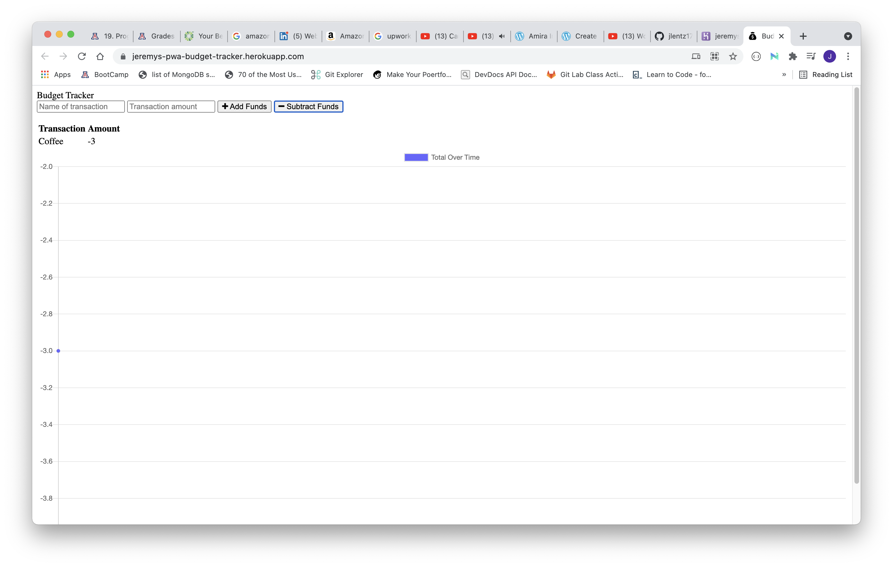

# PWA-budget-tracker

[GitHub Repo](https://github.com/jlentz17/PWA-budget-tracker) 
[Heroku App](https://jeremys-pwa-budget-tracker.herokuapp.com/)

## Description

AS AN avid traveler
I WANT to be able to track my withdrawals and deposits with or without a data/internet connection
SO THAT my account balance is accurate when I am traveling 

## Table of Contents

- [Technologies](#technologies)
- [Installation Instructions](#installation-instructions)
- [Usage](#usage)
- [Tests](#tests)
- [Questions](#questions)

## Technologies

JavaScript, ES6, Node, Express, Service Workers, IndexedDB, PWA

## Installation Instructions

1. Go to deployed heroku site and create a budget!

## Usage

Enter app and input an expense or deposit. A notification will alert user that the info has been saved. This can be used offline as well and installed as an app on a mobile device.

## Tests

Jest, Lighthouse

## Screenshots: 

## Questions

Do you have anything you'd like to contribute? Or have any questions for me?
Contact Me: Jeremy Lentz

GitHub: github.com/jlentz17

Email: jlentz17@gmail.com

Website: https://jeremys-pwa-budget-tracker.herokuapp.com/
